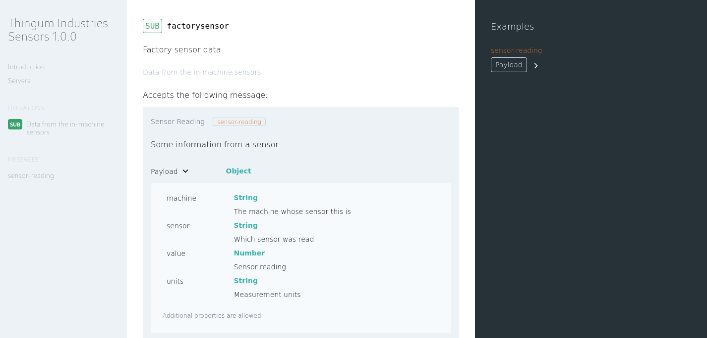

# Thingum Industries: Best Thingumabobs and Thingumajigs Ever!

(Please note that this repo is an imaginary example for demo purposes. You're very welcome to poke around and use anything you find here)

## Apache Kafka and the Avro Schema

You'll find an example Avro schema `machine_sensor.avsc` that is used in these examples. Avro is a binary format used in many places - this example is for using it with Kafka, both as a compression aid and to ensure that the data matches a given format.

## Python Producer for Kafka+Avro Messages

In the `python` folder you will find `sensor.py` which read the schema file, connects to Kakfa, and produces some mssages in the correct data format. To use this example yourself:

* Copy `.env/example` to `.env` and add the URLs for your Schema Registry and Apache Kafka broker. My example uses [Aiven](https://aiven.io) and therefore the schema registry is [Karapace](https://github.com/aiven/karapace).

* Download the certificates and keys to the top-level directory of the project.

* Enable auto topic creation on your Kafka instance (or create the "factory7" topic manually).

* Install the dependencies: `pip install -r requirements.txt`

* Run `python sensor.py` (requires Python3) to get some messages produced to your queue in Avro format.

* If you're using Aiven, the console has the viewer to see the produced messages, decoding the Avro. KafDrop or other clients would work well too :)

## Describing Apache Kafka Payloads with AsyncAPI

The file `asyncapi.yaml` contains a description of what a consumer could expect from the produced messages. The AsyncAPI format can also read the Avro schema, so I didn't need to describe the fields twice to generate code or documentation from this file.

